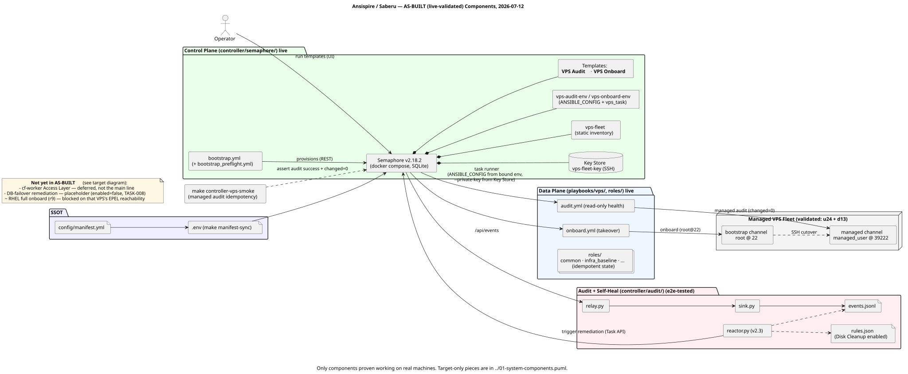
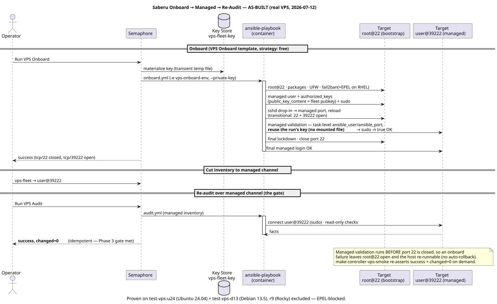
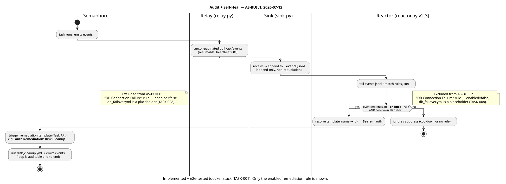

# Architecture — AS-BUILT (what actually runs)

**Scope: only components proven working on real machines as of 2026-07-12.** This
is the honest "what actually runs today" view. The aspirational / full-target
design lives one level up in [`../`](../).

| File | Kind | Shows (as-built) |
|---|---|---|
| [`01-components-as-built.puml`](01-components-as-built.puml) | Component | The live control plane, the validated VPS audit/onboard data plane, the implemented audit self-heal chain, and the managed fleet (u24 + d13). |
| [`02-vps-lifecycle-as-built.puml`](02-vps-lifecycle-as-built.puml) | Sequence | The **proven** onboard → SSH cutover → managed re-audit (`changed=0`) run on real VPS. |
| [`03-audit-selfheal-as-built.puml`](03-audit-selfheal-as-built.puml) | Activity | The self-heal loop with only the **enabled** remediation (Disk Cleanup). |

### Rendered

**Components (as-built)**

**Onboard → managed → re-audit (proven on real VPS)**

**Self-heal (enabled remediation only)**

## What is deliberately NOT here (target-only / not yet proven)

| Item | Status | Where |
|---|---|---|
| cf-worker Access Layer (Wizard + REST) | ⊘ deferred — built + probe-tested, but not the execution main line | target diagram |
| DB-failover remediation rule | ▱ placeholder, `enabled=false` (TASK-008) | target diagram §rules |
| RHEL full onboard chain (r9) | ~ blocked on that VPS's EPEL mirror reachability (infra, not code) | round12 changelog |
| onboard/audit for `modify` / `remove` / `docker_host` / `deploy_compose` | present but not part of the validated Phase 3 loop | vps-lifecycle feature map |

## Validation basis

- **VPS lifecycle** (onboard/audit/managed): real-VPS validated 2026-07-11 — u24 +
  d13 completed onboard → managed re-audit `success` + `changed=0`. See
  `docs/reviews/feat-target-architecture/round10..round12` + TSVS-VPS-ONBOARD-E2E-001.
- **Audit self-heal**: implemented + e2e-tested in the docker stack (TASK-001, closed
  2026-05-10); not yet exercised against the production VPS fleet.

## Render / keep true

Committed `.svg` sit next to each `.puml`; the `.puml` is the source of truth.
Regenerate on change: `plantuml -tsvg docs/architecture/as-built/*.puml`. Update
these **the round a component actually becomes proven** — promote it from the
target diagram to here.
