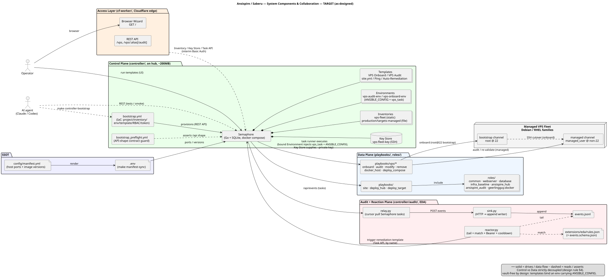
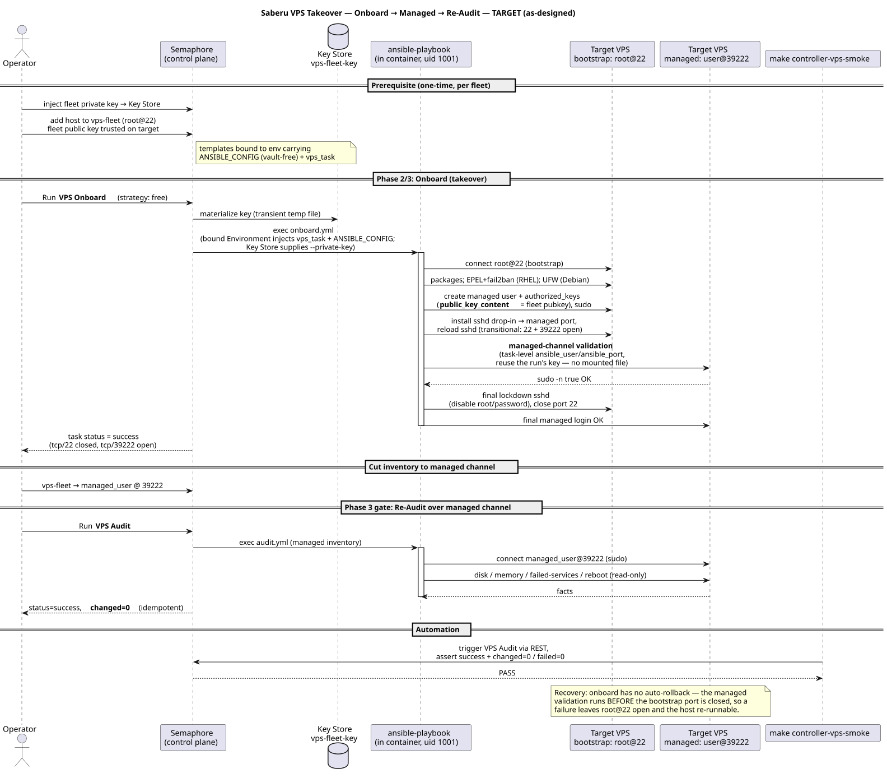
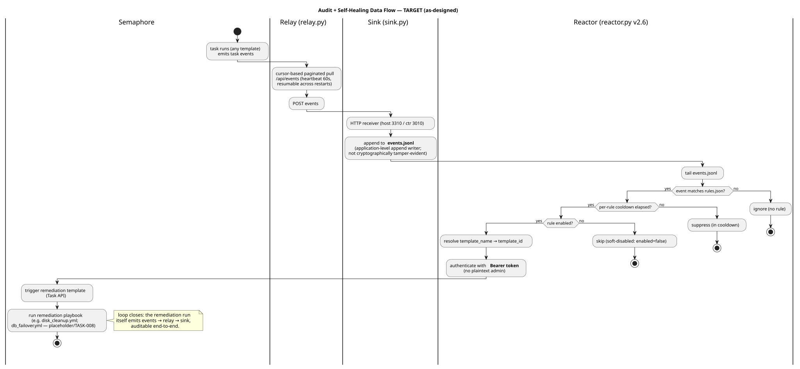

# Architecture Diagrams (PlantUML source)

Canonical, version-controlled diagrams of the Ansispire / Saberu system. Source is
PlantUML (`.puml`) so diffs are reviewable and diagrams travel with the code.
Design truth remains [`ARCHITECTURE.md`](../../../ARCHITECTURE.md); these render it.
To *operate* the Saberu VPS lifecycle these depict, see
[`../operator-guide.md`](../operator-guide.md).

> **Two evidence views** — pick the one you need:
> - **This directory = TARGET (as-designed)**: the full intended architecture,
>   including deferred/planned pieces (cf-worker Access Layer, DB-failover, etc.).
> - **[`as-built/`](as-built/) = AS-BUILT**: implemented behavior with an explicit
>   validation level. Real-VPS proof and Docker/unit coverage are distinguished;
>   they are not presented as equivalent. Update it in place as evidence changes.

| File | Kind | Shows |
|---|---|---|
| [`01-system-components.puml`](01-system-components.puml) | Component / collaboration | All components across the Control / Access / Data / Audit-Reaction planes, who talks to whom, and the responsibility split (control vs data). |
| [`02-vps-lifecycle-sequence.puml`](02-vps-lifecycle-sequence.puml) | Sequence | Processing order + data flow of the Saberu takeover loop: **VPS Onboard → SSH cutover → managed-channel re-audit (`changed=0`)**, incl. where the Key Store key is reused and where the managed validation happens. |
| [`03-audit-selfheal-dataflow.puml`](03-audit-selfheal-dataflow.puml) | Activity / data flow | The intended audit + self-healing loop: Semaphore events → `relay.py` → `sink.py` → `events.jsonl` → `reactor.py` (rules match / cooldown / Bearer) → remediation template. |

### Rendered (TARGET)

**Components / collaboration**



**VPS takeover sequence**



**Audit self-healing data flow**



## Render / regenerate

A committed `.svg` sits next to each `.puml` (rendered with PlantUML 1.2024.7,
emoji-free so it renders on any backend). The **`.puml` is the source of truth**;
regenerate the SVGs whenever a `.puml` changes:

```bash
plantuml -tsvg docs/feat-target-architecture/diagrams/*.puml \
  docs/feat-target-architecture/diagrams/as-built/*.puml
# (needs Java + plantuml.jar; open a .puml in a PlantUML IDE extension to preview)
```

## Keeping them true

Update the relevant `.puml` in the **same round** as a change that alters a
component boundary, a data-flow edge, or the lifecycle order (CLAUDE.md §0 Sync
Guard — treat these like `ARCHITECTURE.md`). Legends note the two invariants:
strict control/data decoupling, and the vault-free template-binds-ANSIBLE_CONFIG rule.
