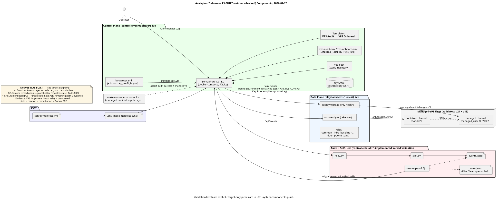
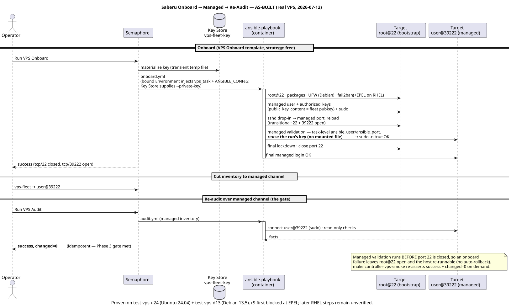
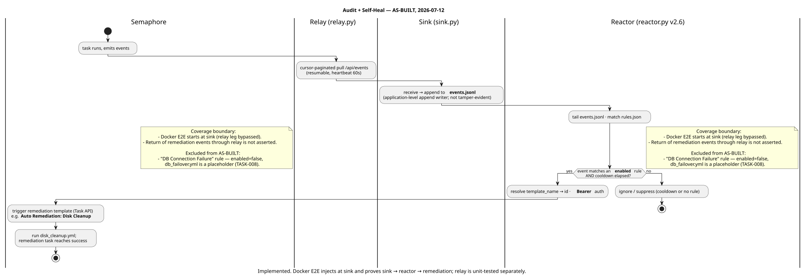

# Architecture — AS-BUILT (what actually runs)

**Scope: implemented behavior with evidence available as of 2026-07-12.** This
view distinguishes real-VPS proof from Docker E2E and unit/component coverage.
The aspirational / full-target design lives one level up in [`../`](../).

| File | Kind | Shows (as-built) |
|---|---|---|
| [`01-components-as-built.puml`](01-components-as-built.puml) | Component | The live control plane, real-VPS-validated audit/onboard path, and the separately tested audit/self-heal components. |
| [`02-vps-lifecycle-as-built.puml`](02-vps-lifecycle-as-built.puml) | Sequence | The **proven** onboard → SSH cutover → managed re-audit (`changed=0`) run on real VPS. |
| [`03-audit-selfheal-as-built.puml`](03-audit-selfheal-as-built.puml) | Activity | The self-heal loop with only the **enabled** remediation (Disk Cleanup). |

### Rendered

**Components (as-built)**

**Onboard → managed → re-audit (proven on real VPS)**

**Self-heal (enabled remediation only)**

## What is deliberately NOT here (target-only / not yet proven)

| Item | Status | Where |
|---|---|---|
| cf-worker Access Layer (Wizard + REST) | ⊘ deferred — built + probe-tested, but not the execution main line | target diagram |
| DB-failover remediation rule | ▱ placeholder, `enabled=false` (TASK-008) | target diagram §rules |
| RHEL full onboard chain (r9) | ~ first blocked at EPEL mirror reachability; the remaining RHEL path is not yet proven | round12 changelog |
| `modify` / `remove` / `docker_host` / `deploy_compose` | present but not part of the validated Phase 3 loop | vps-lifecycle feature map |

## Validation basis

- **VPS lifecycle** (onboard/audit/managed): real-VPS validated 2026-07-11 — u24 +
  d13 completed onboard → managed re-audit `success` + `changed=0`. See
  [`round10`](../../../reviews/feat-target-architecture/round10-2026-07-11.changelog.md),
  [`round11`](../../../reviews/feat-target-architecture/round11-2026-07-11.changelog.md),
  [`round12`](../../../reviews/feat-target-architecture/round12-2026-07-11.changelog.md),
  and [`TSVS-VPS-ONBOARD-E2E-001`](../../../reference/test-specs/vps-onboard-managed-audit-e2e.md).
- **Audit self-heal**: unit/component tests cover relay, sink, reactor, rule matching,
  and the Semaphore request contract. The Docker E2E injects at the sink and proves
  sink → reactor → remediation-task success; it does **not** exercise the relay leg
  or assert that the remediation event returns through the complete loop.

## Render / keep true

Committed `.svg` sit next to each `.puml`; the `.puml` is the source of truth.
Regenerate on change:
`plantuml -tsvg docs/feat-target-architecture/diagrams/as-built/*.puml`. Update
these in the round where implementation or validation evidence changes.
